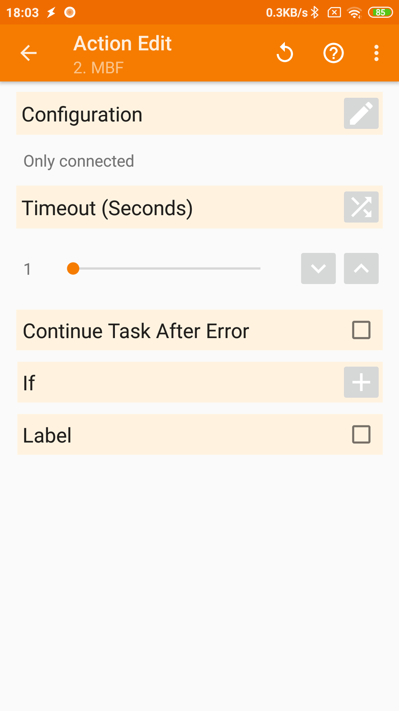

# MBF   
Simple app that allows to change discoverability (i.e. scan mode) of bluetooth.   
Developed because MIUI does not allow to set bluetooth non-discoverable.
Uses reflection.   
   
Includes a tasker plugin so I don't need to code background services etc.   
   
It's the bare minimum to work, with no check for errors, no custom icon etc.    
They may be added on a later date.   

### Screenshots   
   
   
   
License: Apache 2   
   